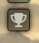
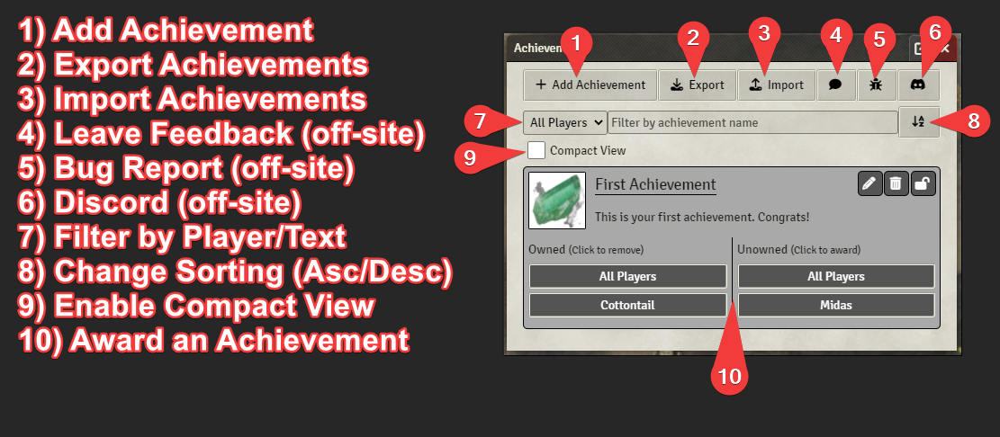
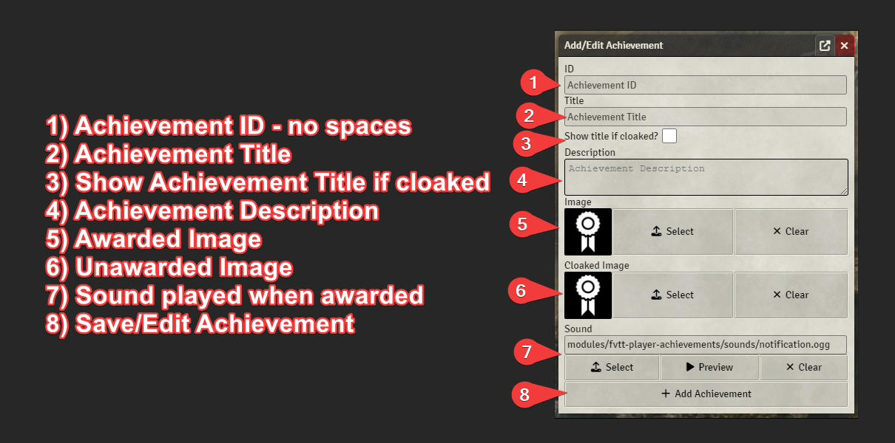
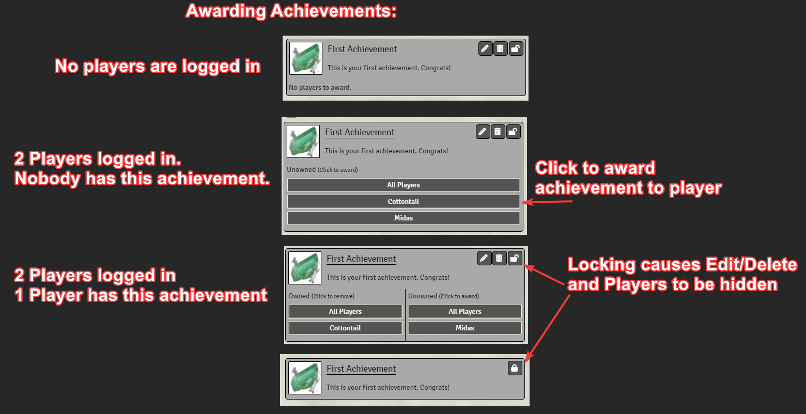
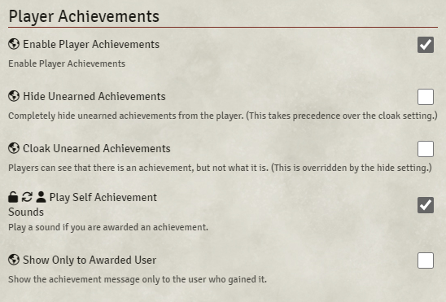
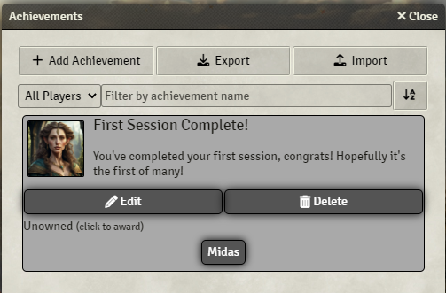
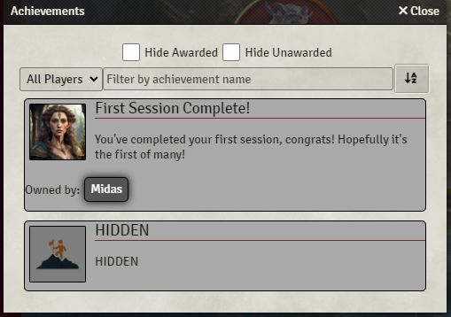
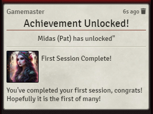
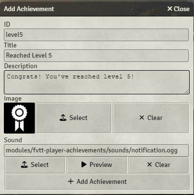

# Player Achievements - A FoundryVTT module

This module provides GMs with a way to award players with achievements.

## Features
  ### Developers
  - Provides an API documented in [API.md](./API.md)
  ### GMs
  - Create your own achievements.
  - Assign/Unassign achievements to/from players.
  - Customize sound played per achievement.
  - Can choose to cloak all unearned achievements details from players.
  - Can choose to allow cloaked achievements to show title on a per achievement basis.
  - Can choose an image to show when an achievement is cloaked.
  - Can choose to hide all unearned achievements from players.
  - Can show achievement earn message to all players or only receiving player.
  - Can backup achievement data to clipboard as JSON.
  - Can restore achievement data from clipboard JSON text.
 ### Players
  - Optionally play a sound when an achievement is earned.
  - Control the volume of achievement sounds if they play.
 ### All
  - Sort Achievement View by achievement name (ascending or descending).
  - Sort Achievement View by owned player.
  - Filter Achievement View by name.

## Known Conflicts
| Plugin | id | Conflict |
| --- | --- | --- |
| Argon - Combat Hud | enhancedcombathud | Opens the Achievement Window after selecting target. |

## Support

Feel free to file a Bug Report / Feature Request under the Issues tab of Github.

Or you can join my **Discord** server here: https://discord.gg/XuGx7zNMKZ

## How to Use - DMs & Players

    Note: Players will see achievements that they are allowed to see based on the DMs options.
    Players will also not see the add-achievement/export/import/award/unaward/etc buttons.

### First, click the Icon on your side panel: </img>

## How to Use - Developers

See [API.md](./API.md)

## Screenshots

### Achievements Icon

  </img>

### Achievements Options

  </img>

### Achievements Screen (GM)

  </img>

### Achievements Screen (Player)

  </img>

### Achievement Message

  </img>

### Add Achievement Screen

  </img>

## Credits

### Sounds
  notification.ogg - [https://freesound.org/people/Rob_Marion/sounds/542043/](https://freesound.org/people/Rob_Marion/sounds/542043/)

### Images
  default.webp - [https://game-icons.net/1x1/skoll/achievement.html](https://game-icons.net/1x1/skoll/achievement.html)

### Localization

  Spanish - @maeonian
