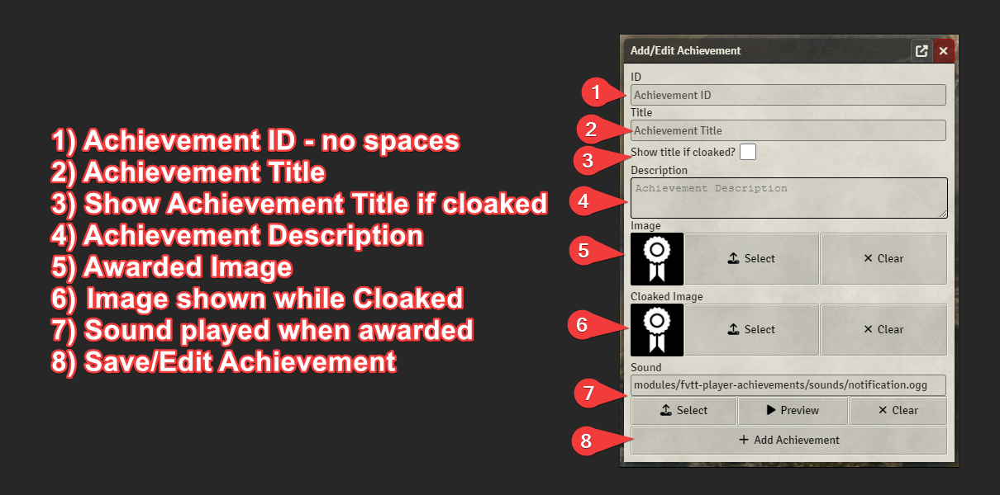
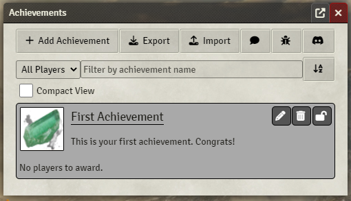
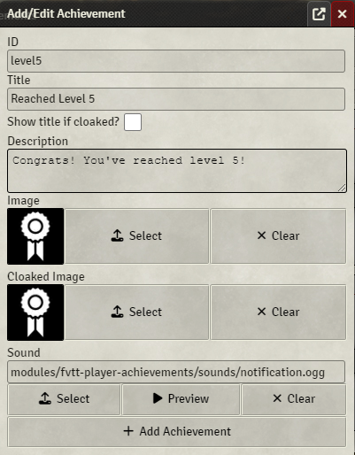

# Player Achievements - A FoundryVTT module

This module provides GMs with a way to award players with achievements.


[](https://www.foundryvtt-hub.com/package/fvtt-player-achievements/)
[](https://www.foundryvtt-hub.com/package/fvtt-player-achievements/)

## Links

| Upcoming Changes | API Documentation |
| --- | --- |
| [Link](UPCOMING_CHANGELOG.md) | [Link](API.md) |

## Features

### Developers

- Provides an API documented in [API.md](./API.md)
- Provides hooks for after achievement award/unaward.

### GMs

- Create your own achievements.
- Add tags to achievements for easier display filtering.
- Choose to show or hide tags when players view achievements.
- Assign/Unassign achievements to/from players.
- Award achievements to players that are offline and they will recieve them when they next login.
- Customize sound played per achievement.
- Choose to cloak all unearned achievements details from players.
- Choose to allow cloaked achievements to show title on a per achievement basis.
- Choose an image to show when an achievement is cloaked.
- Choose to hide all unearned achievements from players.
- Show achievement earn message to all players or only receiving player.
- Backup achievement data to clipboard as JSON.
- Restore achievement data from clipboard JSON text.
- Use special markup to include newlines, bold, and italic text in descriptions of achievements.

### Players

- Optionally play a sound when an achievement is earned.
- Control the volume of achievement sounds if they play.

### All

- Sort Achievement View by achievement name (ascending or descending).
- Sort Achievement View by owned player.
- Filter Achievement View by name.

## Known Conflicts

| Plugin | id | Conflict |
| --- | --- | --- |
| Argon - Combat Hud | enhancedcombathud | Opens the Achievement Window after selecting target. |

## Support

Feel free to file a Bug Report / Feature Request under the Issues tab of Github.

## How to Use - DMs & Players

    Note: Players will see achievements that they are allowed to see based on the DMs options.
    Players will also not see the add-achievement/export/import/award/unaward/etc buttons.

### First, click the Icon on your side panel: 





### Markup

The following tags are supported in the Achievement Description:

- {nl} - Inserts a line break
- {b}{/b} - Contents will be <b>bold</b>
- {i}{/i} - Contents will be <i>italics</i>
- {u}{/u} - Contents will be <u>underlined</u>

## How to Use - Developers

### Hooks for Achievement Events

The module provides two hooks, "**fvtt-player-achievements.awardAchievement**" and "**fvtt-player-achievements.unAwardAchievement**", allowing developers to integrate custom functionality after an achievement is granted or removed to/from a character.

***Both hooks grant two parameters, the Achievement ID and the Character UUID, in that order.***

#### Example Usage:

 ```javascript
  // Triggered after an achievement is granted to a character
  Hooks.on("fvtt-player-achievements.awardAchievement", (achievementId, characterUUID) => {
    console.log(`Character ${characterUUID} has gained the achievement: ${achievementId}`);
  });
```

### API

An API is also provided that allows direct control of this module. See [API.md](./API.md)

## Screenshots

### Achievements Icon

  

### Achievements Options

  

### Achievements Screen (GM)

  

### Achievements Screen (Player)

  

### Achievement Message

  

### Add Achievement Screen

  

## Credits

### Sounds

  notification.ogg - [https://freesound.org/people/Rob_Marion/sounds/542043/](https://freesound.org/people/Rob_Marion/sounds/542043/)

### Images

  default.webp - [https://game-icons.net/1x1/skoll/achievement.html](https://game-icons.net/1x1/skoll/achievement.html)

### Localization

  Spanish - @maeonian

  Brazilian Portuguese - Daniel Norberto
