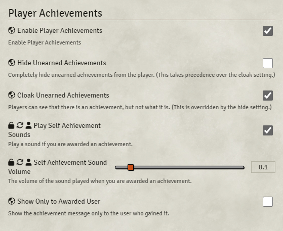

# Player Achievements - A FoundryVTT plugin

## Features
  ### GMs
  - Create your own achievements.
  - Assign/Unassign achievements to/from players.
  - Can choose to cloak all unearned achievements details from players.
  - Can choose to hide all unearned achievements from players.
  - Can show achievement earn message to all players or only receiving player.
  - Can backup achievement data to clipboard as JSON.
  - Can restore achievement data from clipboard JSON text.
 ### Players
  - Optionally play a sound when an achievement is earned.
 ### All
  - Sort Achievement View by achievement name (ascending or descending).
  - Sort Achievement View by owned player.
  - Filter Achievement View by name.

## Screenshots

### Achievements Icon

  </img>

### Achievements Options

  </img>

### Achievements Screen (GM)

  </img>

### Achievements Screen (Player)

  </img>

### Achievement Message

  </img>

### Add Achievement Screen

  </img>
